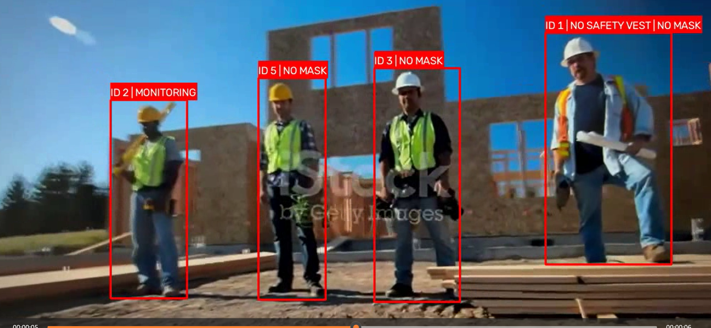
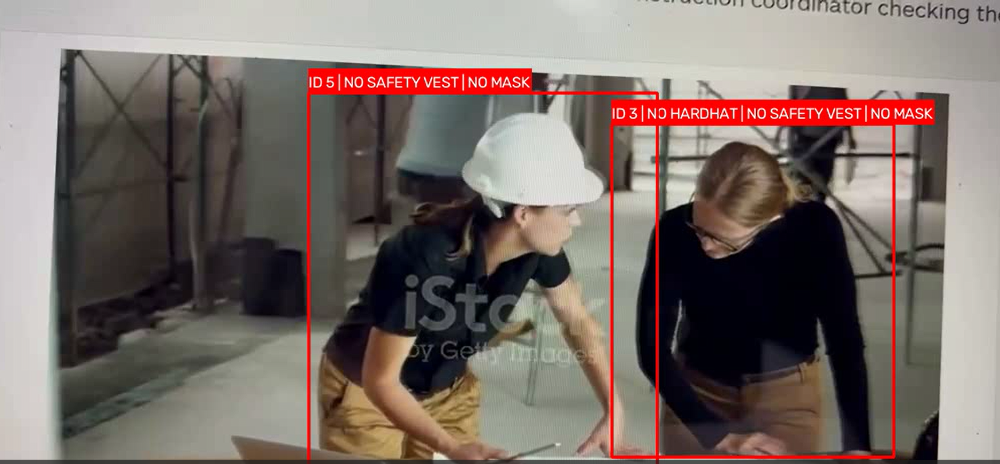
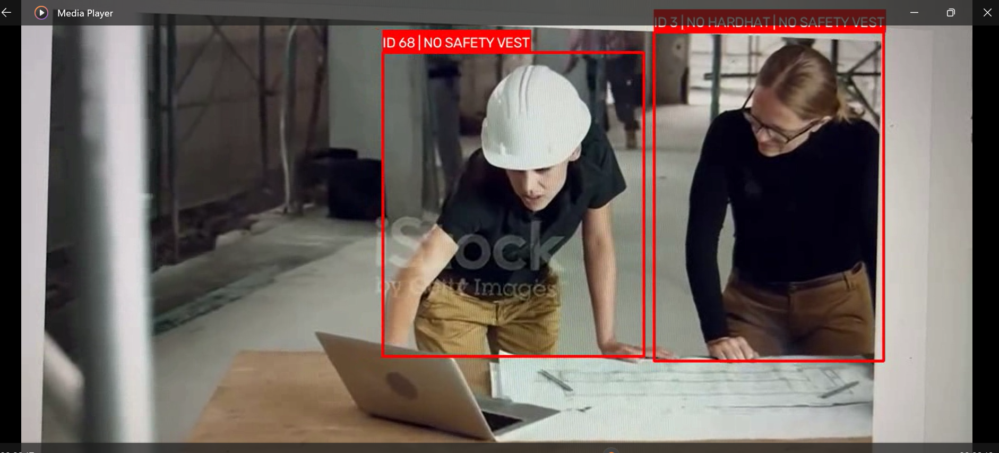
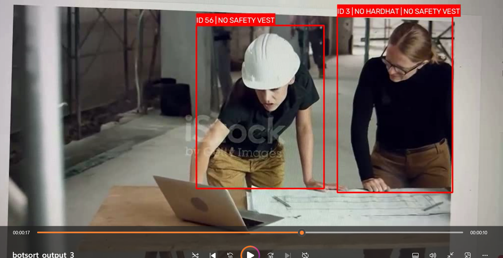
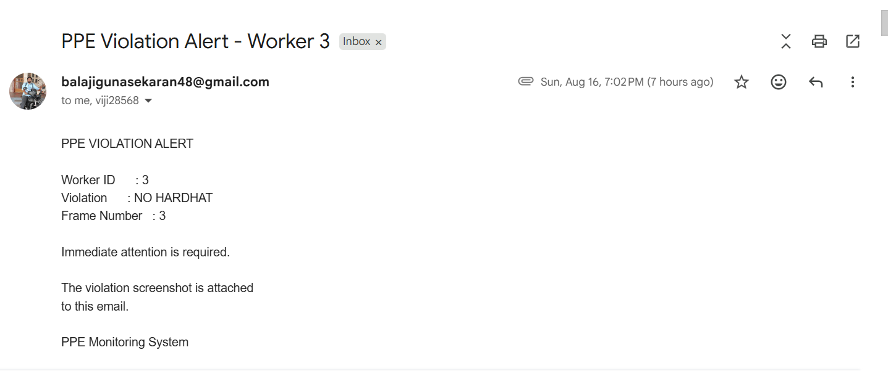
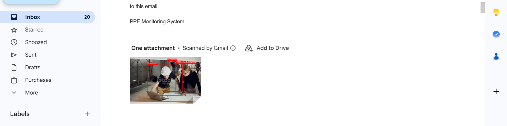

# 🚧 Real-Time PPE Safety Monitoring System

A real-time **Personal Protective Equipment (PPE) Safety Monitoring System** built using Computer Vision and Deep Learning.

The system detects workers and PPE equipment from video, tracks workers across frames, evaluates PPE compliance, maintains a temporal PPE state, captures evidence for confirmed violations, generates CSV reports, and automatically sends email alerts with violation screenshots to designated recipients.

---

## 📌 Project Overview

Workplace safety monitoring often requires continuous observation to ensure that workers are wearing the required Personal Protective Equipment such as:

- ⛑️ Hardhats
- 🦺 Safety Vests
- 😷 Masks

Manual monitoring can be difficult to scale across multiple workers and camera feeds.

This project demonstrates an end-to-end Computer Vision pipeline that automatically:

1. Detects workers and PPE.
2. Tracks workers across video frames.
3. Maintains a consistent application-level worker identity.
4. Evaluates PPE compliance.
5. Confirms violations using temporal PPE state tracking.
6. Captures screenshots as violation evidence.
7. Generates CSV-based reports.
8. Sends automated email alerts to site supervisors.

The project was developed as a hands-on Computer Vision project to explore real-time video analytics and production-oriented AI application design.

---

# 🎯 Objectives

The main objectives of this project are:

- Detect workers in video streams.
- Detect PPE equipment and PPE violations.
- Track multiple workers across consecutive video frames.
- Maintain a consistent worker identity when tracker IDs change.
- Reduce false alerts using temporal PPE state tracking.
- Capture screenshots when PPE violations are confirmed.
- Generate frame-level PPE reports.
- Automatically notify site supervisors through email.
- Support multiple email recipients for escalation.
- Generate annotated output videos for visual verification.

---

# 🧠 System Architecture

```text
                       Video / Camera
                            │
                            ▼
                  ┌───────────────────┐
                  │   YOLO Detection  │
                  │                   │
                  │ Person + PPE      │
                  └─────────┬─────────┘
                            │
                            ▼
                  ┌───────────────────┐
                  │ Object Tracking   │
                  │                   │
                  │ OC-SORT /         │
                  │ ByteTrack        │
                  └─────────┬─────────┘
                            │
                            ▼
                  ┌───────────────────┐
                  │   PPE Rule Engine │
                  │                   │
                  │ Worker ↔ PPE      │
                  │ Association       │
                  └─────────┬─────────┘
                            │
                            ▼
                  ┌───────────────────┐
                  │  PPE State Tracker│
                  │                   │
                  │ Temporal State    │
                  │ Management        │
                  └─────────┬─────────┘
                            │
                 ┌──────────┼─────────────┐
                 │          │             │
                 ▼          ▼             ▼
            CSV Report  Screenshot    Email Alert
                         Evidence      to Recipients


```
# 🔍 PPE Detection

The system identifies workers and PPE-related classes using a trained YOLO object detection model.

### PPE Classes

| Class | Description |
|---|---|
| `Person` | Worker/person |
| `Hardhat` | Worker wearing a hardhat |
| `NO-Hardhat` | Missing hardhat |
| `Safety Vest` | Worker wearing a safety vest |
| `NO-Safety Vest` | Missing safety vest |
| `Mask` | Worker wearing a mask |
| `NO-Mask` | Missing mask |

The detected PPE objects are associated with the corresponding worker using the PPE rule engine.

---

## 🎥 Project Demo

The following demonstrations show the PPE monitoring system running on recorded construction-site video.

### OC-SORT Tracking

Demonstrates worker detection, PPE detection, worker tracking, PPE violation identification and annotated output generation using OC-SORT.

### 🎥 OC-SORT Tracking Demo

[](https://www.youtube.com/watch?v=_l1E8tSOTEg)

*Click the image to watch the OC-SORT PPE monitoring demonstration.*


### 🎥 OC-SORT Tracking Demo

[](https://youtu.be/vb5aSOj4doE)

*Click the image to watch the OC-SORT PPE monitoring demonstration.*

### 🎥 Byte-Track Tracking Demo

[](https://youtu.be/vdR2Vrz85NM)

*Click the image to watch the OC-SORT PPE monitoring demonstration.*

### 🎥 BOT-SORT Tracking Demo

[](https://youtu.be/IcE62PyZiIc)

*Click the image to watch the OC-SORT PPE monitoring demonstration.*

### Complete Pipeline

```text
Video Input
     ↓
YOLO PPE Detection
     ↓
Object Tracking
     ↓
Worker Identity Association
     ↓
Temporal PPE State Tracking
     ↓
Violation Confirmation
     ↓
Screenshot Evidence
     ↓
CSV Reporting
     ↓
Email Alert
```


## 👷 Worker Tracking

The project supports multi-object tracking using Ultralytics-compatible tracking algorithms such as:

- **OC-SORT**
- **ByteTrack**

The tracker generates a temporary tracking ID for each detected person.

However, a tracker ID should not always be treated as a permanent worker identity because tracking algorithms can change IDs during an ongoing video.

For this reason, the project contains a `PPEStateTracker` that maintains a canonical application-level worker identity.

---

## 🆔 Worker Identity Association

When a tracker ID changes, the system attempts to determine whether the new detection belongs to an existing worker using:

- **Bounding-box IoU**
- **Center-point distance**
- **Maximum allowed missing frames**
- **One-to-one worker assignment**

### Example

The tracker may initially assign:

```text
OC-SORT ID 5
       │
       ▼
   Worker 5

   If the tracker later changes the tracking ID:

OC-SORT ID 5
       │
       │ Tracker ID changes
       ▼
OC-SORT ID 68

The PPEStateTracker can associate the new tracker ID with the existing application-level worker:

OC-SORT ID 68
       │
       ▼
   Worker 5

This prevents a tracker ID change from automatically creating a new logical worker.
```
#### Why Worker Identity Association Is Required

Object trackers can change tracking IDs because of situations such as:

- Temporary detection loss
- Occlusion
- Bounding-box changes
- Tracking association failure
- Changes in object position

Therefore, the application maintains its own worker identity instead of relying solely on the raw tracker ID.


## 🧮 Temporal PPE State Tracking

A single incorrect detection should not immediately generate a violation alert.

The PPE state tracker maintains recent detection history for each worker and uses this history to determine whether a PPE violation is persistent enough to be considered confirmed.

#### Example
```
Frame 1 → NO MASK
Frame 2 → NO MASK
Frame 3 → NO MASK
Frame 4 → NO MASK
             │
             ▼
     Confirmed Violation
```
This temporal approach helps reduce alerts caused by isolated detection errors.

The system maintains PPE history for:

- Helmet
- Safety Vest
- Mask

The PPE state is evaluated using the configured violation threshold.

---

## 🚨 Violation Detection

The system identifies PPE violations when a worker is confirmed to be missing the required safety equipment.

Supported violations include:
```
NO HARDHAT
NO SAFETY VEST
NO MASK
```

Multiple violations can be associated with the same worker.

Example
```
Worker 5

NO SAFETY VEST | NO MASK
```
The confirmed violation is then passed to the reporting and alert components.

### Violation Processing
```
PPE Detection
      │
      ▼
PPE Rule Evaluation
      │
      ▼
Temporal PPE State Tracking
      │
      ▼
Violation Confirmed
      │
      ├───────────────┐
      ▼               ▼
CSV Report       Alert Manager
                      │
                      ▼
                Screenshot + Email
```

### 📸 Violation Evidence

When a confirmed PPE violation occurs, the system automatically captures the current annotated video frame.

The screenshot provides visual evidence of the detected violation and can be attached to the corresponding email alert.

### Evidence Generation Workflow
```
PPE Violation Confirmed
          │
          ▼
   Annotated Video Frame
          │
          ▼
    Screenshot Captured
          │
          ▼
    Screenshot Saved
          │
          ▼
   Attached to Email
```
The generated screenshots are stored locally in the configured alerts directory.

### Example
```
alerts/
├── frame_125_worker_5_NO_MASK.jpg
├── frame_341_worker_3_NO_HARDHAT.jpg
└── frame_420_worker_1_NO_SAFETY_VEST.jpg
```
The screenshots can be used as evidence when reviewing PPE violations.


## 📧 Automated Email Alerts

The project includes an AlertManager module that sends confirmed PPE violation alerts through SMTP.

When a violation is confirmed:

The violation is detected.
- An annotated screenshot is generated.
- The screenshot is saved locally.
- An email notification is created.
- The screenshot is attached to the email.
- The email is sent to the configured recipients.

### Example Email

Example Email
```
Subject:
PPE Violation Alert - Worker 5


Worker ID:
5


Violation:
NO SAFETY VEST


Frame Number:
327
```
Attachment:

#### Violation Email Screenshot

<p align="center">
  
</p>

<p align="center">
  
</p>


### Multiple Recipients

The system supports sending the same violation alert to multiple recipients.

For example:

                 PPE Violation
                       │
                       ▼
                 Alert Manager
                       │
             ┌─────────┴─────────┐
             │                   │
             ▼                   ▼
      Site Supervisor      Safety Officer
             │                   │
             └─────────┬─────────┘
                       ▼
                  Email Alert

This allows a confirmed violation to be escalated to multiple responsible personnel.

## 📊 CSV Reporting

The system generates a CSV report containing worker-level PPE information for processed video frames.

The CSV provides a structured record of the PPE monitoring results and can be used for analysis and reporting.

### Information Recorded

The report can contain information such as:
```
Frame Number
Worker ID
Helmet Status
Vest Status
Mask Status
Violation Status
```
### Example
```
Frame Number,Worker ID,Helmet,Vest,Mask,Status
1,1,True,True,False,NO MASK
2,1,True,True,False,NO MASK
3,1,True,True,False,NO MASK
```
### Use Cases

The generated CSV can be used for:

1. PPE compliance analysis
2. Violation review
3. Worker-level analysis
4. Debugging and validation
5. Historical reporting
6. Future dashboard/reporting systems

The CSV is currently used as a reporting and export mechanism.

### 🎥 Output Video

The system generates an annotated output video containing the detection and tracking results.

The output video can display:

- Worker bounding boxes
- Worker IDs
- PPE detection results
- PPE violation status
- Tracking information

This allows the detection and tracking results to be visually reviewed after processing.

### Output Workflow

```text
Input Video
     │
     ▼
YOLO Detection
     │
     ▼
Object Tracking
     │
     ▼
PPE Evaluation
     │
     ▼
Annotated Frame
     │
     ▼
Output Video
```

Generated videos are stored in:

```text
data/output_videos/
```

## 🛠️ Technologies Used
### Programming
- Python
### Computer Vision
- OpenCV
### Deep Learning
- YOLO
- Ultralytics
### Object Tracking
- OC-SORT 
- ByteTrack
### Data Processing
- CSV
- Python data structures
### Automation
- SMTP
- Email attachments

## 📁 Project Structure
```text
ppe-monitoring/
│
├── README.md
├── requirements.txt
├── .gitignore
│
├── src/
│   ├── main.py
│   ├── config.py
│   ├── detector.py
│   ├── detection.py
│   ├── ppe_rules.py
│   ├── ppe_state.py
│   ├── csv_logger.py
│   ├── alert_manager.py
│   └── visualizer.py
│
├── models/
│   └── README.md
│
├── data/
│   ├── input_videos/
│   └── output_videos/
│
├── alerts/
│
├── reports/
│
├── logs/
│
└── docs/
    └── architecture.png

```
### ⚙️ Installation

### 1. Clone the Repository
```text
git clone <YOUR_GITHUB_REPOSITORY_URL>
cd ppe-monitoring
```
### 2. Create a Virtual Environment

For Windows:

```powershell
python -m venv ppe
```

Activate the environment:
```powershell
.\ppe\Scripts\Activate.ps1
```
### 3. Install Dependencies
```powershell
pip install -r requirements.txt
```

## 🧠 Model Weights

The trained YOLO model weights are intentionally not included in this repository.

Place the trained model at:
```powershell
models/best.pt
```
The model path should be configured through ```
config.py.```

**Note:** Model weights are excluded from GitHub using ```
.gitignore.```

## 🎥 Input Video

Place input videos inside:

```powershell
data/input_videos/
```

Example:
```
data/
└── input_videos/
    └── sample_video.mp4
```

The application processes the input video and generates an annotated output video.

## 📧 Email Configuration

Email credentials should never be hardcoded in the source code.

The application uses environment variables.

### Windows PowerShell

#### Set the sender email:

```powershell
$env:PPE_SENDER_EMAIL="your_sender@gmail.com"
```
Set the Gmail App Password:
```powershell
$env:PPE_EMAIL_PASSWORD="your_google_app_password"
```
Set the supervisor email:
```powershell
$env:PPE_SUPERVISOR_EMAIL="supervisor@company.com"
```

For Gmail SMTP authentication, use a Google App Password instead of your normal Gmail password.

**Security:** Never commit email passwords, Google App Passwords, API keys, or other credentials to GitHub.


## ▶️ Running the Application
From the project root:
```powershell
python src/main.py
```
The application will:

1.  Load the YOLO model.
2.  Open the input video.
3.  Detect workers and PPE.
4.  Track workers.
5.  Evaluate PPE compliance.
6.  Maintain temporal PPE state.
7.  Generate CSV records.
8.  Save violation screenshots.
9.  Send email alerts for confirmed violations.
10. Generate the annotated output video.

### Saving Application Logs

To run the application and save the console output to a log file:

```powershell
python src/main.py > logs\ppe_monitoring_1.log 2>&1
```

This command:

- Runs the PPE monitoring application.
- Saves standard output to `logs\ppe_monitoring_1.log`.
- Redirects error messages to the same log file.
- Allows the application logs to be reviewed later without relying only on the terminal.

Example:

```text
logs/
└── ppe_monitoring_1.log
```

> Generated log files are excluded from the Git repository using ```
.gitignore.```

----

## 📂 Generated Outputs

After processing, generated files can include:
```
data/
└── output_videos/
    └── annotated_output.mp4

reports/
└── ppe_report.csv

alerts/
├── frame_125_worker_5_NO_MASK.jpg
└── frame_341_worker_3_NO_HARDHAT.jpg

logs/
└── ppe_monitoring.log
```
Generated files are excluded from the Git repository using ```
.gitignore.```

## 🔐 Security
The following files and information should not be committed
```
*.pt
*.onnx
*.engine
.env
Email passwords
Google App Passwords
API keys
Private credentials
Large input videos
Large output videos
Generated logs
Generated reports
```

These files should be excluded using ```
.gitignore.```


## 📈 Future Improvements

The following improvements are planned for future versions of the system:
- Persistent database storage for PPE events
- Real-time RTSP camera integration
- Multi-camera monitoring
- Web-based monitoring dashboard
- Centralized violation history
- Daily and weekly automated reports
- Improved worker re-identification
- Cloud-based deployment
- Containerized deployment
- Model optimization for edge devices
- Real-time system health monitoring

## 🎯 Key Learning Outcomes

This project provided hands-on experience with building a complete Computer Vision application rather than only training an object detection model.

### Key Areas Explored
- Real-time object detection
- Multi-object tracking
- Worker identity association
- Temporal PPE state management
- PPE rule-based decision making
- False-positive reduction
- Video processing
- Evidence generation
- CSV reporting
- Automated email notification
- Modular Python application design

### End-to-End Pipeline
```
 Detection
    ↓
Tracking
    ↓
Worker Identity
    ↓
State Management
    ↓
Decision Logic
    ↓
Evidence
    ↓
Reporting
    ↓
Alerting
```

## 🚀 Project Status
### Working Prototype

The current implementation supports:
- ✅ YOLO-based PPE detection
- ✅ Multi-worker tracking
- ✅ OC-SORT / ByteTrack
- ✅ Worker identity association
- ✅ Temporal PPE state tracking
- ✅ PPE violation confirmation
- ✅ Annotated output video
- ✅ CSV reporting
- ✅ Violation screenshot generation
- ✅ Email alerts
- ✅ Multiple email recipients

The system is being progressively enhanced toward a production-oriented real-time safety monitoring architecture.

## 🔎 Limitations

The current implementation is primarily designed for video-based testing and demonstration.

Detection and tracking performance can be affected by:

- Camera position
- Lighting conditions
- Worker distance from the camera
- Worker occlusion
- PPE visibility
- Camera movement
- Detection model accuracy
- Tracking performance

The system should therefore be evaluated under the specific environmental conditions in which it will eventually be deployed.

## 👨‍💻 Author

Balaji G

Computer Vision Engineer | AI/ML | Deep Learning | Real-Time Video Analytics

## 📌 Disclaimer

This project is a portfolio and learning project demonstrating the design and implementation of a Computer Vision based PPE monitoring system.

It is not intended to replace formal workplace safety procedures, certified safety equipment, or human safety supervision.